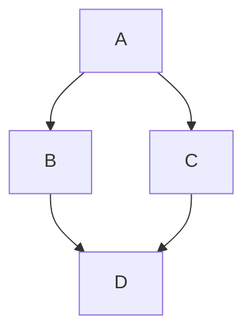

# Delivery System UI

React + Vite + TypeScript frontend for the Delivery Van Management System.

## Getting Started

```bash
cd delivery-ui
npm install
npm run dev
```

## Getting Done

- [x] Single page app with navigation and responsive layout
- [x] Customizable configuration `/config`
- [x] Simple starting page/feature `/pages`
- [x] Github action deploy github pages

## Deploy `gh-pages`

- change `basenameProd` in `/vite.config.ts`
- create deploy key `GITHUB_TOKEN` in github `/settings/keys`
- commit and push changes code
- setup github pages to branch `gh-pages`
- run action `Build & Deploy`

### Auto Deploy

- change file `.github/workflows/build-and-deploy.yml`
- Comment on `workflow_dispatch`
- Uncomment on `push`

```yaml
# on:
#   workflow_dispatch:
on:
  push:
    branches: ["main"]
```

## Features

- React + Vite + TypeScript
- Tailwind CSS
- [shadcn-ui](https://github.com/shadcn-ui/ui/)
- [react-router-dom](https://www.npmjs.com/package/react-router-dom)

## Project Structure

```md
delivery-ui/
├── public/            # Public assets
├── src/               # Application source code
│   ├── components/    # React components
│   ├── context/       # contexts components
│   ├── config/        # Config data
│   ├── hook/          # Custom hooks
│   ├── lib/           # Utility functions
│   ├── pages/         # pages/features components
│   ├── App.tsx        # Application entry point
│   ├── index.css      # Main css and tailwind configuration
│   ├── main.tsx       # Main rendering file
│   └── Router.tsx     # Routes component
├── index.html         # HTML entry point
├── tsconfig.json      # TypeScript configuration
└── vite.config.ts     # Vite configuration
```

## Diagrams



## License

This project is licensed under the MIT License.
